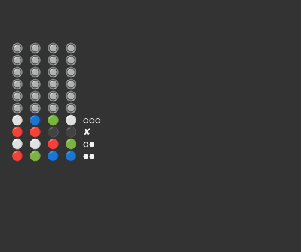
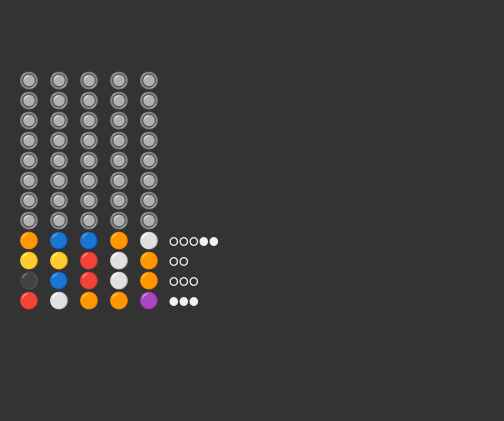
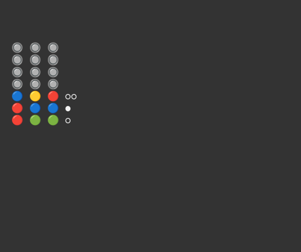
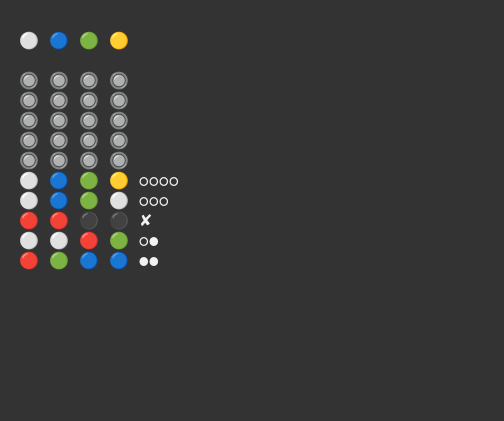

# Mastermind


<p align="center">
  
</p>


This is a simple Bash implementation of the old code-breaking game *Mastermind*, played on a plastic board with coloured pegs and popular in the 1970s.

## Requirements

- Bash >= 4.3
- A UTF-8–capable, ANSI / VT100-compatible terminal emulator with emoji support (eg gnome-console, Tilix)
- `tput` - for terminal control / colours

##  Features

- Classic, deluxe and minimal game modes
- Unicode/emoji terminal UI
- Keyboard-driven input with backspace support
- Clean exit and secret reveal on quit

## Notes

The original game involved two players. One player would set a "code" or "secret" consisting of four coloured pegs, behind a small plastic flap or "screen". The second player then had ten goes to guess the code. Afer he or she entered each guess, the first player would provide feedback in the form of smaller black and white pegs.

One black "feedback" peg would be placed for each "entry" peg matching a peg of the same colour in the same position in the secret. One white feedback peg would be placed for each entry peg matching a peg of the same colour in a different position. Six colours were available, and the code could be composed of any combination - so that there are 1,296 possible different codes.

A "deluxe" version was also available, in which the code breaker has a maximum of 12 goes. The code consists of five pegs, composed of eight possible colours. The program supports this version of a game, and also a "minimal" mode in which the code is composed of three pegs drawn from four possible colours.

The idea is for the "code breaker" player to use the clues to work out the secret. If unfamiliar with the rules, please use the Wikipedia entry for the game to scrutinise them more carefully.

In this Bash implementation, the computer assumes the role of the code maker, providing feedback for each of the player's entries. The game ends when the player runs out of goes (failure), or correctly enters the "secret" (success).

The player can play either in the original or "deluxe" mode.


## Installation

Download the script directly:

```bash
wget https://github.com/StarShovel/bash-mastermind/raw/main/bash-mastermind.sh
chmod +x bash-mastermind.sh
```

Alternatively, clone the full repository:

```bash
git clone https://github.com/StarShovel/bash-mastermind.git
cd bash-mastermind
```


## Usage

Run the game from the command line:

```./bash-mastermind.sh```

Or for "deluxe mode":

```./bash-mastermind.sh -d```

Or for "minimal mode":

```./bash-mastermind.sh -m```

It's intended to run on a terminal with a dark background.

**IMPORTANT**: start the game in a terminal with dimensions 32x16 minimum. Most terminal emulators have a default of 80x24, and that will work nicely. Resizing while the script is running will break the game.

## Instructions

At the beginning of the game, the player will be presented with an empty board, like this:


Pegs are entered by pressing keys corresponding to the required colour:

- **R**: Red
- **B**: Blue
- **G**: Green
- **Y**: Yellow
- **W**: White
- **N**: Black (or "Noir")

It's unfortunate that Blue and Black share the same initial letter. I can only think that whoever designed the game in 1971 didn't have the foresight to consider that a keyboard-driven computer version might be possible.

You can use the backspace key to remove the last peg. Confirm by pressing the enter key, at which point the computer will provide feedback using black and white pegs.

Codes are entered starting at the bottom row (nearest to the code breaker in the physical game). In the following example, The code breaker has entered four codes. The feedback for the first entry means that the player has placed two correct colours, neither in the correct position. The ✘ for the third attempt means that none of the colours are present in the secret code. In the fourth attempt, the player has placed three colours in the right position.




### Deluxe Mode

In deluxe mode, as indicated above, two more colours are available. These are:

- **O**: Orange
- **P**: Purple

In the original game these were orange and brown, but although an emoji character does exist for a brown circle, in practice it looks a bit too similar to the orange character. A screenshot is shown below.

The player has twelve goes to guess a five-peg code.




### Minimal Mode

In minimal mode only four colours are available, these are:

- **R**: Red
- **B**: Blue
- **G**: Green
- **Y**: Yellow

The player has eight goes to guess a three-peg code.




## Game Conclusion

The game ends when the player enters the right code, or runs out of goes. The player can also press 'Q' or (of course) Ctrl-C to exit. In any event, the secret code will be revealed at the top of the screen, as shown below:



## Terminal Colour Scheme

Although the game is intended to run in a terminal with a dark background, it's eminently playable in a terminal with a light background and dark text provided emoji characters are supported. The larger coloured "peg" emojis will look exactly the same, *however* - the smaller black and white "feedback" pegs will be rendered in reverse. If in doubt: the "hollow" pegs represent the "black" pegs, the other ones represent the "white" pegs.


---

## License

*Bash Mastermind* is free software: you can redistribute it and/or modify it under the terms of the [GNU General Public License](LICENSE) as published by the Free Software Foundation, either version 3 of the License, or (at your option) any later version.

This program is distributed **without any warranty**; without even the implied warranty of **merchantability** or **fitness for a particular purpose**.

See the [LICENSE](LICENSE) file for details.

© James Gibbon, January 2026
